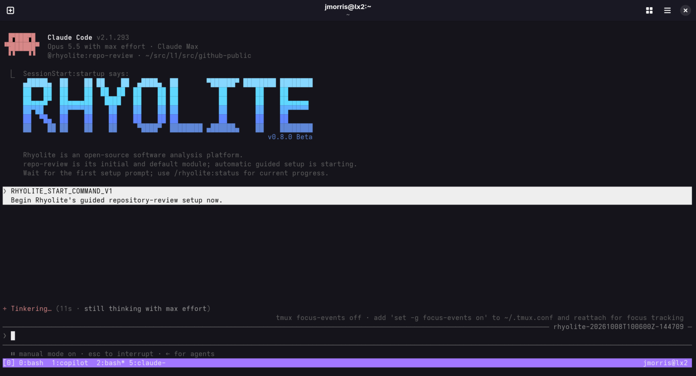
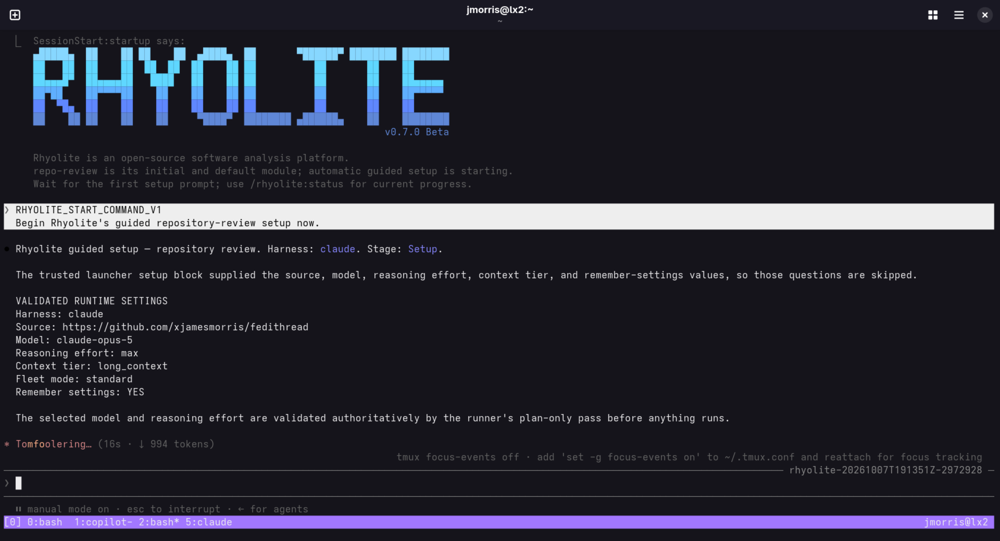
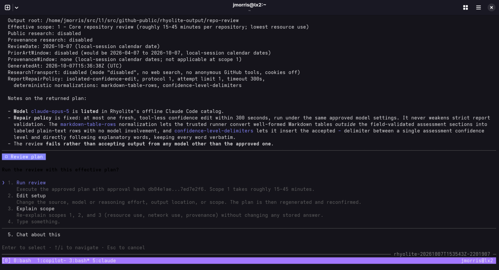
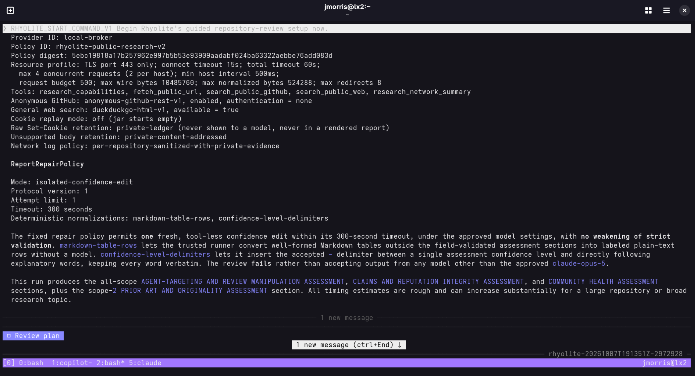
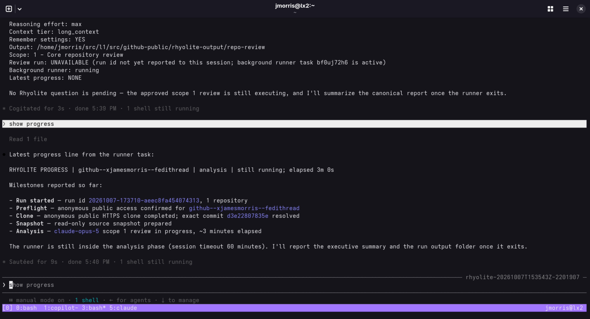
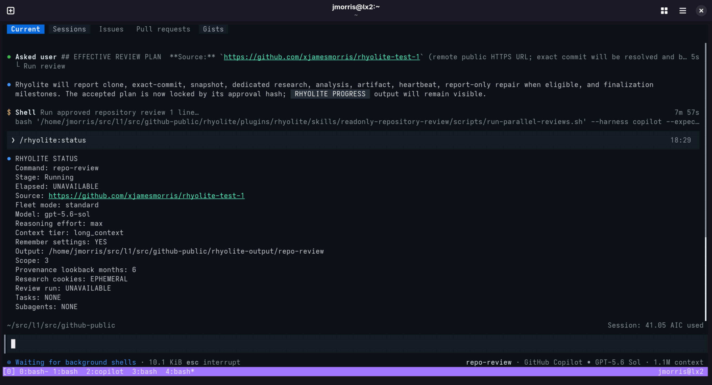

# Rhyolite screencaps

These screenshots walk through Rhyolite's `repo-review` workflow, from launch
through plan approval to live progress, in Claude Code and GitHub Copilot
CLI. The [README](README.md) opens with the GitHub Copilot CLI launcher, and
the
[sample scope 3 review](docs/sample-reviews/astra-6-rhyolite-test-1-review.md)
shows example report output.

The screenshots were captured across recent releases, so version numbers,
model names, and some wording can differ from the current release.

## Launch in Claude Code

Running `./rhyolite --harness claude` opens Claude Code with the
`repo-review` agent selected. The display-only start hook shows the Rhyolite
plaque, and guided setup begins automatically.

## Guided setup

The launcher hands the source, model, reasoning effort, context tier, and
remember-settings choice to the agent in a trusted setup block, so guided
setup skips those questions. The runner then validates these settings in a
plan-only pass before anything runs.

## Effective review plan

Before a review starts, Rhyolite shows the effective plan, including the
scope, research settings, review dates, and report repair policy.
`Run review` executes the plan bound to the displayed approval hash,
`Edit setup` changes answers and regenerates the plan, and `Explain scope`
describes the three scopes. This scope 1 plan keeps public research disabled.

## Public research disclosure

Scopes 2 and 3 add public research through a local research broker. Their
plans disclose the broker policy and digest, resource limits, exact research
tools, anonymous GitHub access, web search provider, cookie handling, and
network logging, followed by the report repair policy. All of it is part of
the approved plan.

## Progress milestones

Long reviews emit `RHYOLITE PROGRESS` milestones and heartbeats. Here the
agent relays the latest progress line and the milestones so far: run start,
anonymous preflight, clone at an exact commit, read-only snapshot, and
analysis.

## Status in GitHub Copilot CLI

GitHub Copilot CLI, the default harness, follows the same workflow. After
plan approval, the runner works in a background shell, and `/rhyolite:status`
reports the stage, source, model, settings, and scope. This scope 3 review
uses a six-month provenance lookback and ephemeral research cookies.

